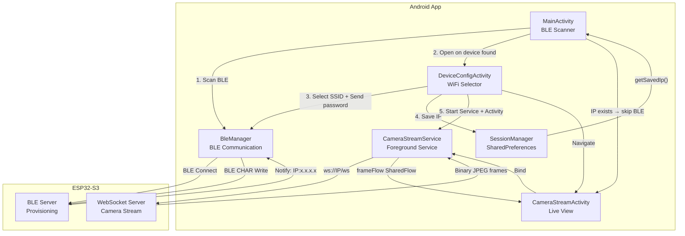
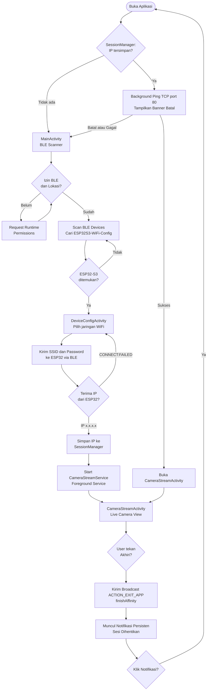
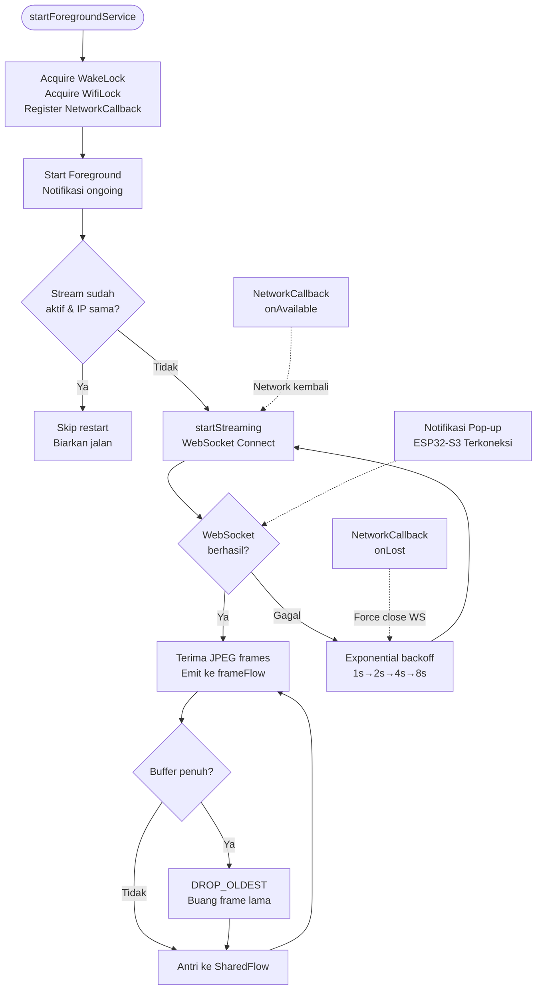
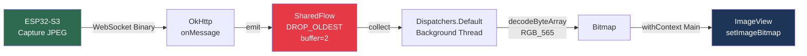

# VNetra Phase 4 — Sistem Kamera Nirkabel ESP32-S3 + Android

> **Gambaran Proyek**: Sistem kamera nirkabel real-time yang menggabungkan firmware ESP32-S3 ([`eps32s3_camera_with_mobile/`](eps32s3_camera_with_mobile/README.md)) sebagai server kamera dengan aplikasi Android sebagai klien tampilan live.

---

## Daftar Isi

- [Gambaran Sistem](#gambaran-sistem)
- [Teknologi & Arsitektur](#teknologi--arsitektur)
- [Alur Kerja Aplikasi](#alur-kerja-aplikasi)
- [Komponen Utama](#komponen-utama)
- [Stabilitas Koneksi](#stabilitas-koneksi)
- [Optimasi Latensi](#optimasi-latensi)
- [Permission yang Dibutuhkan](#permission-yang-dibutuhkan)
- [Cara Build & Install](#cara-build--install)
- [Struktur Proyek](#struktur-proyek)

---

## Gambaran Sistem

```
┌────────────────────────────────────────────────────────────────┐
│                     SISTEM KAMERA NIRKABEL                     │
│                                                                │
│  ┌─────────────────┐              ┌──────────────────────────┐ │
│  │   ESP32-S3 Cam  │              │     Android App          │ │
│  │                 │ ──BLE────►  │  1. Scan BLE             │ │
│  │  BLE Server     │ ◄──BLE───   │  2. Kirim SSID+Password  │ │
│  │  WebSocket Srv  │             │  3. Terima IP            │ │
│  │  OV2640 Camera  │ ──WiFi──►  │  4. Connect WebSocket    │ │
│  │                 │   JPEG      │  5. Tampilkan Live Feed  │ │
│  └─────────────────┘             └──────────────────────────┘ │
│                                                                │
│  [eps32s3_camera_with_mobile/]            [aplikasi ini]      │
└────────────────────────────────────────────────────────────────┘
```

---

## Teknologi & Arsitektur

### Stack Teknologi

| Komponen | Teknologi | Versi |
|----------|-----------|-------|
| Bahasa | Kotlin | 1.9+ |
| UI | View Binding + XML | - |
| BLE | Android Bluetooth LE API | API 21+ |
| WebSocket | OkHttp WebSocket | 4.x |
| Concurrency | Kotlin Coroutines + Flow | 1.7+ |
| Background Service | Android Foreground Service | API 26+ |
| Persistence | SharedPreferences (SessionManager) | - |
| Min SDK | Android 8.0 (Oreo) | API 26 |
| Target SDK | Android 13+ | API 33+ |

### Diagram Arsitektur



---

## Alur Kerja Aplikasi

### Flowchart Utama



### Flowchart Background Service



### Flowchart Frame Rendering (Low Latency)



---

## Komponen Utama

### `MainActivity`
Entry point aplikasi. Bertanggung jawab untuk:
- Selalu menampilkan antarmuka BLE Scanner setiap kali aplikasi dibuka.
- Memeriksa `SessionManager` — jika IP tersimpan, aplikasi akan melakukan *background ping* (TCP Socket ke port 80) sambil menampilkan banner informatif. Jika ESP32 *online*, otomatis beralih ke layar kamera.
- Menangani runtime permissions: `BLUETOOTH_SCAN`, `BLUETOOTH_CONNECT`, `ACCESS_FINE_LOCATION`
- Urutan permission yang benar: request `BLUETOOTH_CONNECT` dulu → enable Bluetooth → scan
- Mencari device BLE dengan nama `ESP32S3-WiFi-Config`

### `DeviceConfigActivity`
Layar konfigurasi WiFi. Bertanggung jawab untuk:
- Mengirim command `"SCAN"` ke ESP32 via BLE untuk meminta scan jaringan WiFi
- Menerima response `"COUNT:n"` lalu `"BATCH:..."` berisi daftar SSID
- Menampilkan daftar SSID untuk dipilih user
- Mengirim `"CONNECT:SSID|password"` ke ESP32 via BLE Characteristic Write
- Menerima response `"IP:x.x.x.x"` dari ESP32 jika sukses, atau `"CONNECT:FAILED:..."` jika gagal
- Menyimpan IP ke `SessionManager` dan memulai streaming

### `CameraStreamActivity`
Layar tampilan kamera live. Bertanggung jawab untuk:
- Menampilkan frame JPEG real-time dari ESP32
- Mengikat (bind) ke `CameraStreamService` untuk mengakses `frameFlow`
- Mengobservasi `connectionState` untuk menampilkan badge koneksi
- Menekan Back → `moveTaskToBack(true)` (minimize, **bukan** destroy)
- Counter FPS untuk monitoring performa

### `CameraStreamService` ⭐ (Komponen Utama)
Foreground Service yang menjaga koneksi WebSocket tetap hidup. Fitur utama:

| Fitur | Implementasi | Tujuan |
|-------|-------------|--------|
| **WakeLock** | `PARTIAL_WAKE_LOCK` 12 jam | Cegah CPU sleep saat streaming |
| **WifiLock** | `WIFI_MODE_FULL_LOW_LATENCY` | Cegah WiFi radio masuk power-saving |
| **Exit Behavior** | Broadcast `ACTION_EXIT_APP` | Menutup aplikasi secara total & memunculkan notifikasi persisten *Reconnect* |
| **NetworkCallback** | `ConnectivityManager` | Deteksi perubahan jaringan → trigger reconnect |
| **Exponential Backoff** | 1s→2s→4s→8s | Reconnect cerdas tanpa flood server |
| **DROP_OLDEST** | `BufferOverflow.DROP_OLDEST` | Selalu tampilkan frame terbaru, bukan frame lama |
| **onTaskRemoved** | Tidak panggil stopSelf() | Service tetap hidup saat user swipe close |
| **START_STICKY** | Return value onStartCommand | OS restart service jika dibunuh paksa |

### `SessionManager`
Wrapper `SharedPreferences` untuk menyimpan IP ESP32-S3 secara persisten. Memungkinkan aplikasi bypass BLE scan saat dibuka kembali.

```kotlin
sessionManager.saveEsp32Ip("192.168.1.xxx")  // Simpan saat terima dari BLE
sessionManager.getSavedEsp32Ip()              // Ambil saat app dibuka
sessionManager.clearSession()                // Hapus saat disconnect manual
```

### `BleManager`
Abstraksi komunikasi BLE dengan ESP32-S3:
- Scan → Connect → Discover Services → Subscribe Notification
- Write command ke `CHAR_COMMAND_UUID`
- Terima response dari `CHAR_RESPONSE_UUID`

---

## Stabilitas Koneksi

Sistem menggunakan **5 lapisan perlindungan** untuk memastikan koneksi tidak terputus:

```
Layer 1: WakeLock         → CPU tidak sleep = network stack tetap aktif
Layer 2: WifiLock         → WiFi radio full power = tidak ada packet delay
Layer 3: NetworkCallback  → Deteksi network change & trigger reconnect
Layer 4: Exponential backoff → Reconnect otomatis tanpa crash
Layer 5: WebSocket ping 15s  → TCP keepalive agar router tidak drop koneksi
```

### Notifikasi Sistem

| Notifikasi | Channel | Kapan muncul |
|-----------|---------|-------------|
| **Ongoing** (tidak bisa dismiss) | `IMPORTANCE_LOW` | Selama Service aktif (selalu) |
| **Heads-up** (pop-up) | `IMPORTANCE_HIGH` | Saat ESP32 pertama kali terkoneksi |

---

## Optimasi Latensi

Total latensi teoritis end-to-end: **80–150ms** (sebelum optimasi: 700–900ms)

| Optimasi | Dampak |
|---------|--------|
| `SharedFlow(DROP_OLDEST)` | Eliminasi lag 600ms dari frame queue buildup |
| Decode JPEG di `Dispatchers.Default` | Decode tidak blokir UI thread |
| `TCP_NODELAY` di ESP32 | Eliminasi Nagle delay hingga 200ms |
| HVGA 480×320 (vs VGA 640×480) | Frame lebih kecil → transmisi lebih cepat |
| XCLK 24MHz (vs 20MHz) | Readout sensor kamera lebih cepat |
| Pre-allocated PSRAM buffer | Hindari malloc/free per frame di ESP32 |

---

## Permission yang Dibutuhkan

| Permission | Kegunaan | Kapan diminta |
|-----------|---------|--------------| 
| `INTERNET` | WebSocket ke ESP32 | Auto (Manifest) |
| `ACCESS_NETWORK_STATE` | Cek status jaringan | Auto |
| `BLUETOOTH_SCAN` | Scan BLE devices | Runtime (MainActivity) |
| `BLUETOOTH_CONNECT` | Koneksi & enable BT | Runtime (MainActivity) |
| `ACCESS_FINE_LOCATION` | Wajib untuk BLE scan API < 31 | Runtime |
| `FOREGROUND_SERVICE` | Jalankan background service | Auto |
| `WAKE_LOCK` | CPU tidak sleep saat streaming | Auto |
| `ACCESS_WIFI_STATE` | WifiLock untuk low-latency | Auto |
| `POST_NOTIFICATIONS` | Heads-up notification | Runtime (CameraStreamActivity, Android 13+) |
| `REQUEST_IGNORE_BATTERY_OPTIMIZATIONS` | Bypass Doze mode | Runtime (Dialog system) |

---

## Cara Build & Install

### Prasyarat

- Android Studio Hedgehog 2023.1.1+
- JDK 17 (bundled dengan Android Studio)
- Android device dengan Bluetooth LE dan WiFi (min Android 8.0)
- ESP32-S3 sudah di-flash dengan firmware terbaru

### Build via Android Studio

1. Buka folder root proyek `VNetra/` di Android Studio
2. Tunggu Gradle sync selesai
3. Pilih device target
4. Run → **Run 'app'**

### Build via Command Line

```powershell
# Set JAVA_HOME ke JDK Android Studio
$env:JAVA_HOME = "C:\Program Files\Android\Android Studio\jbr"

# Build & install langsung ke device
.\gradlew.bat installDebug

# Build APK saja
.\gradlew.bat assembleDebug
# Output: app/build/outputs/apk/debug/app-debug.apk
```

---

## Alur Penggunaan Pertama Kali

```
1. Pastikan ESP32-S3 sudah dinyalakan → LED Biru berkedip (siap BLE)
2. Buka aplikasi Android
3. Tap "Scan ESP32" → pilih device "ESP32S3-WiFi-Config" dari list
4. Pilih jaringan WiFi yang sama dengan HP kamu
5. Masukkan password → Tap "Connect"
6. Tunggu ESP32 terkoneksi → notifikasi "ESP32-S3 Terkoneksi" muncul
7. Layar kamera live otomatis terbuka
8. Tekan Back → app minimize, streaming tetap jalan di background
9. Buka app lagi → langsung masuk ke layar kamera (skip BLE scan)
```

---

## Struktur Proyek

```
VNetra/
├── app/src/main/
│   ├── AndroidManifest.xml
│   ├── java/.../
│   │   ├── MainActivity.kt              ← BLE Scanner & entry point
│   │   ├── ble/
│   │   │   └── BleManager.kt            ← BLE abstraction layer
│   │   ├── model/
│   │   │   └── WifiInfo.kt              ← Data class jaringan WiFi
│   │   ├── service/
│   │   │   └── CameraStreamService.kt   ← ⭐ Foreground Service (WebSocket)
│   │   ├── ui/
│   │   │   ├── CameraStreamActivity.kt  ← ⭐ Live camera view
│   │   │   └── DeviceConfigActivity.kt  ← WiFi provisioning UI
│   │   └── util/
│   │       └── SessionManager.kt        ← Persistent IP storage
│   └── res/
│       ├── layout/
│       │   └── activity_camera_stream.xml
│       └── drawable/
│           └── badge_connected_bg.xml
├── eps32s3_camera_with_mobile/
│   └── esp32s3_camera_with_mobile/
│       └── esp32s3_camera_with_mobile.ino  ← ⭐ Firmware ESP32-S3
└── build.gradle.kts
```

---

## Lihat Juga

- 🔌 **ESP32 Firmware** → [`eps32s3_camera_with_mobile/README.md`](eps32s3_camera_with_mobile/README.md)
- 📡 **Protokol WebSocket** → Lihat bagian [Protokol WebSocket](eps32s3_camera_with_mobile/README.md#protokol-websocket) di README firmware
