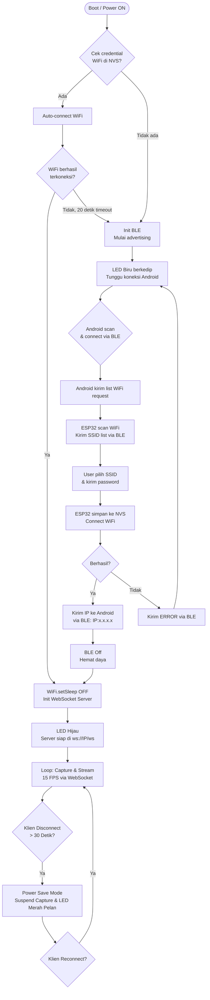
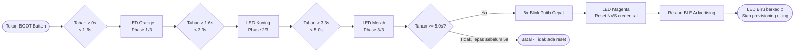

# ESP32-S3 Firmware — BLE Provisioning + WebSocket Camera Stream

> **Bagian dari sistem**: Firmware ini adalah **sisi perangkat keras (ESP32-S3)** yang bekerja bersama aplikasi Android ([phase4-camera-eps-s3-mobile](../../../phase4-camera-eps-s3-mobile/README.md)) untuk membentuk sistem kamera nirkabel real-time.

---

## Daftar Isi

- [Gambaran Sistem](#gambaran-sistem)
- [Hardware yang Digunakan](#hardware-yang-digunakan)
- [Teknologi & Library](#teknologi--library)
- [Alur Kerja Sistem](#alur-kerja-sistem)
- [Protokol WebSocket](#protokol-websocket)
- [Mekanisme Reset Credential WiFi](#mekanisme-reset-credential-wifi)
- [Konfigurasi & Optimasi Kamera](#konfigurasi--optimasi-kamera)
- [Cara Setup Arduino IDE](#cara-setup-arduino-ide)
- [Pemetaan GPIO](#pemetaan-gpio)

---

## Gambaran Sistem

```
┌─────────────────────────────────────────────────────────────┐
│                    SISTEM KAMERA NIRKABEL                   │
│                                                             │
│   ┌──────────────┐     BLE (Provisioning)    ┌───────────┐ │
│   │   ESP32-S3   │ ◄─────────────────────── │  Android  │ │
│   │  + OV2640    │ ─────────────────────── ► │   App     │ │
│   │  + WS2812    │     WebSocket (Camera)    │           │ │
│   └──────────────┘         via WiFi          └───────────┘ │
│                                                             │
│   [Firmware ini]                         [phase4 Android]  │
└─────────────────────────────────────────────────────────────┘
```

ESP32-S3 bertindak sebagai **server kamera embedded** dengan dua mode operasi:
1. **Mode Provisioning (BLE)** — saat pertama kali atau setelah reset credential
2. **Mode Streaming (WiFi/WebSocket)** — setelah berhasil terkoneksi ke jaringan WiFi

---

## Hardware yang Digunakan

| Komponen | Spesifikasi | Keterangan |
|----------|-------------|------------|
| **MCU** | ESP32-S3 WROOM N16R8 | Dual-core Xtensa LX7, 240 MHz, 16MB Flash, 8MB OPI PSRAM |
| **Kamera** | OV2640 | Hardware JPEG encoder, resolusi maks 2MP |
| **LED** | WS2812 RGB (GPIO 48) | Indikator status sistem |
| **Reset Button** | GPIO 0 (BOOT button) | Tahan 5 detik untuk hapus credential WiFi |

---

## Teknologi & Library

| Library | Fungsi |
|---------|--------|
| `esp_camera.h` | Driver kamera OV2640, akses DMA frame buffer |
| `BLEDevice / BLEServer` | Bluetooth Low Energy server untuk WiFi provisioning |
| `ESPAsyncWebServer` | Async WebSocket server (non-blocking, event-driven) |
| `AsyncTCP` | TCP layer untuk ESPAsyncWebServer |
| `Adafruit NeoPixel` | Kontrol LED WS2812 RGB |
| `Preferences` | Simpan credential WiFi ke NVS (Non-Volatile Storage) |

---

## Alur Kerja Sistem

### Flowchart Utama (Boot)



### Flowchart BLE Provisioning Detail

```mermaid
sequenceDiagram
    participant ESP as ESP32-S3
    participant AND as Android App

    AND->>ESP: BLE Connect
    ESP->>AND: BLE Connection OK

    AND->>ESP: Command: "SCAN_WIFI"
    ESP->>ESP: Scan jaringan WiFi
    ESP->>AND: Response: "WIFI_LIST:SSID1,SSID2,SSID3"

    AND->>ESP: Command: "CONNECT:SSID|password"
    ESP->>ESP: Simpan ke NVS
    ESP->>ESP: WiFi.begin(ssid, pass)

    alt WiFi berhasil
        ESP->>AND: Response: "IP:192.168.1.xxx"
        ESP->>ESP: BLE Off, start WebSocket
        AND->>ESP: WebSocket Connect ws://192.168.1.xxx/ws
        ESP-->>AND: Binary stream JPEG frames
    else WiFi gagal
        ESP->>AND: Response: "ERROR:Connection failed"
    end
```

### Flowchart Reset Credential WiFi



---

## Protokol WebSocket

Semua data dikirim dalam **format binary frame** dengan struktur:

```
┌──────────────────────────────────────────────────────┐
│  Byte 0    │  Byte 1-8          │  Byte 9+           │
│  Frame     │  Timestamp (µs)    │  Payload           │
│  Type      │  uint64 LE         │                    │
├──────────────────────────────────────────────────────┤
│  0x01 JPEG │  esp_timer_get()   │  JPEG binary data  │
│  0x02 IMU  │  timestamp         │  [reserved - future MPU6050 + EKF]  │
│  0x03 HBEAT│  timestamp         │  (kosong)          │
│  0x04 TOF  │  timestamp         │  [reserved - future VL53L5CX]       │
│  0x05 CTRL │  timestamp         │  Control command   │
└──────────────────────────────────────────────────────┘

Total header = 9 bytes
JPEG payload = variable (biasanya 8-25 KB pada HVGA quality 15)
```

### Endpoint

```
WebSocket : ws://<IP_ESP32>/ws
Port      : 80 (default HTTP/WS)
Format    : Binary (bukan text)
```

### Fitur Protokol

| Fitur | Detail |
|-------|--------|
| **TCP_NODELAY** | Aktif saat client connect → eliminasi Nagle delay 200ms |
| **Heartbeat** | Frame `0x03` setiap 10 detik untuk keep-alive |
| **Frame drop** | Server skip frame jika heap < 30KB untuk hindari crash |
| **Quality control** | Client dapat kirim `0xA1 <quality>` untuk ubah kualitas JPEG real-time |
| **Extensible** | Frame type `0x02` (IMU) dan `0x04` (ToF) sudah disiapkan untuk sensor masa depan |

---

## Mekanisme Reset Credential WiFi

Reset dilakukan dengan menekan **tombol BOOT (GPIO 0)** selama tepat **5 detik**.

| Fase | Waktu | LED |
|------|-------|-----|
| Phase 1 | 0 – 1.6 detik | 🟠 Orange |
| Phase 2 | 1.6 – 3.3 detik | 🟡 Kuning |
| Phase 3 | 3.3 – 5.0 detik | 🔴 Merah |
| Konfirmasi | Setelah 5 detik | ⚪ 6× blink putih cepat |
| Proses reset | Selama hapus NVS | 🟣 Magenta |
| Selesai | BLE aktif kembali | 🔵 Biru berkedip |

> **Jika tombol dilepas sebelum 5 detik** — tidak ada yang terjadi, reset dibatalkan.

---

## Konfigurasi & Optimasi Kamera

### Parameter Kamera

```cpp
cfg.xclk_freq_hz = 24000000;       // 24 MHz: readout sensor lebih cepat
cfg.frame_size   = FRAMESIZE_HVGA; // 480×320: balance kualitas vs latensi
cfg.pixel_format = PIXFORMAT_JPEG; // Hardware JPEG (OV2640 built-in encoder)
cfg.jpeg_quality = 15;             // 0=terbaik, 63=terburuk (15=balance)
cfg.fb_count     = 3;              // Triple buffer PSRAM: pipeline smooth
cfg.grab_mode    = CAMERA_GRAB_LATEST; // Selalu ambil frame terbaru
```

### Jika Masih Lag

Ganti resolusi ke yang lebih kecil di `initCamera()`:
```cpp
// Level 1 (default): 480×320
cfg.frame_size = FRAMESIZE_HVGA;

// Level 2: 400×296
cfg.frame_size = FRAMESIZE_CIF;

// Level 3 (minimum lag): 320×240
cfg.frame_size = FRAMESIZE_QVGA;
```

### Optimasi WiFi

```cpp
WiFi.setSleep(false);        // KRITIKAL: nonaktifkan power saving WiFi
WiFi.setAutoReconnect(true); // Auto-reconnect jika sinyal hilang
```

---

## Cara Setup Arduino IDE

### 1. Install Board Package

```
File → Preferences → Additional Boards Manager URLs:
https://raw.githubusercontent.com/espressif/arduino-esp32/gh-pages/package_esp32_index.json
```

Tools → Board Manager → cari **esp32** → Install

### 2. Install Library

Library Manager (`Ctrl+Shift+I`):
- `ESPAsyncWebServer` by lacamera (atau me-no-dev)
- `AsyncTCP` by dvarrel (atau me-no-dev)
- `Adafruit NeoPixel`

### 3. Board Settings

| Setting | Nilai |
|---------|-------|
| Board | ESP32S3 Dev Module |
| PSRAM | OPI PSRAM |
| Flash Size | 16MB |
| Partition Scheme | Huge APP (3MB No OTA/1MB SPIFFS) |
| CPU Frequency | 240 MHz |
| Upload Speed | 921600 |

### 4. Upload

1. Tahan tombol BOOT, tekan RESET, lepas BOOT
2. Klik Upload di Arduino IDE
3. Setelah upload selesai, tekan RESET sekali lagi

---

## Pemetaan GPIO

| GPIO | Fungsi | Keterangan |
|------|--------|------------|
| 0 | Reset Button | BOOT button bawaan |
| 4 | SIOD (SDA) | I2C kamera |
| 5 | SIOC (SCL) | I2C kamera |
| 6 | VSYNC | Kamera |
| 7 | HREF | Kamera |
| 8 | Y4 | Data kamera |
| 9 | Y3 | Data kamera |
| 10 | Y5 | Data kamera |
| 11 | Y2 | Data kamera |
| 12 | Y6 | Data kamera |
| 13 | PCLK | Kamera pixel clock |
| 15 | XCLK | Kamera master clock |
| 16 | Y9 | Data kamera |
| 17 | Y8 | Data kamera |
| 18 | Y7 | Data kamera |
| 48 | WS2812 RGB LED | Status indicator |

---

## Indikator LED Status

| Warna | Kondisi |
|-------|---------|
| 🔵 Biru berkedip | Menunggu koneksi BLE dari Android |
| 🟡 Kuning | Sedang koneksi WiFi |
| 🟢 Hijau | WiFi terkoneksi, WebSocket aktif |
| 🔴 Merah berkedip cepat | Error (kamera gagal init, dll) |
| 🔴 Merah berkedip pelan | **Power Save Mode** (Klien disconnect > 30s, capture ditangguhkan) |
| 🟣 Magenta | Proses reset credential |
| ⚪ Putih blink | Konfirmasi reset berhasil |

---

## Lihat Juga

- 📱 **Android App** → [`phase4-camera-eps-s3-mobile/README.md`](../README.md)
- 📊 **Wiring Diagram** → [`wiring-diagram.md`](./wiring-diagram.md)
